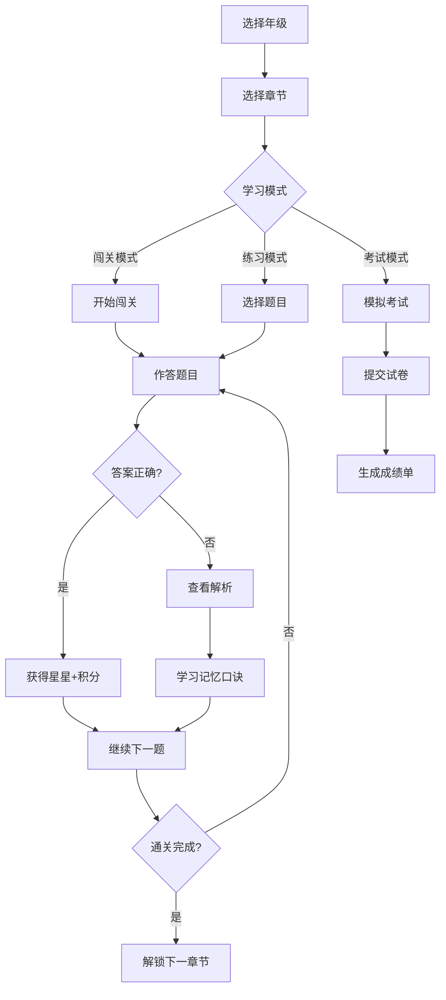

# 小学生奥数学习平台 - 产品需求文档

## 1. 产品概述

**奥数星球** - 一款专为小学生打造的趣味奥数学习平台，涵盖1-6年级共1800+道精选原题。平台采用闯关游戏化学习模式，让孩子在快乐中掌握奥数思维。

- **核心价值**：将枯燥的奥数学习转化为有趣的闯关游戏，通过渐进式难度设计、详细教学解析和即时反馈机制，帮助学生高效提升数学思维能力
- **目标用户**：小学1-6年级学生（6-12岁）、家长和教师

## 2. 核心功能

### 2.1 用户角色

| 角色 | 注册方式 | 核心权限 |
|------|----------|----------|
| 学生用户 | 昵称+年级选择 | 闯关练习、模拟考试、查看学习报告 |
| 游客用户 | 无需注册 | 浏览首页、体验示例题目 |

### 2.2 功能模块

1. **首页** - 欢迎界面、年级入口、闯关进度展示、平台导航
2. **年级学习系统** - 6个年级入口、每个年级300+道题目、4个难度等级
3. **闯关模式** - 游戏化关卡设计、星星评分、进度存档
4. **练习模式** - 逐题练习、即时反馈、教学解析
5. **模拟考试** - 自动组卷、计时考试、详细成绩分析
6. **知识图谱** - 奥数知识点分类、思维导图、学习路径
7. **平台导航** - 链接到奥数网、学而思、猿辅导等主流平台

### 2.3 页面详情

| 页面名称 | 模块名称 | 功能描述 |
|----------|----------|----------|
| 首页 | 欢迎区域 | 动态星球背景、角色引导、学习统计 |
| 首页 | 年级选择 | 6个年级卡片、难度预览、学习进度 |
| 首页 | 闯关入口 | 当前进度、继续学习按钮 |
| 年级页面 | 章节列表 | 10个知识章节、难度标签、题目数量 |
| 年级页面 | 关卡选择 | 闯关模式、星级评价、难度挑战 |
| 练习页面 | 题目展示 | 题目文本、插图、选项/填空 |
| 练习页面 | 教学区 | 知识点讲解、解题思路、记忆口诀 |
| 练习页面 | 解析区 | 详细解答、思路分析、举一反三 |
| 考试页面 | 试卷展示 | 倒计时、题目列表、进度指示 |
| 考试页面 | 成绩单 | 得分分析、错题统计、能力雷达图 |
| 导航页面 | 平台列表 | 各大奥数平台入口、网站介绍 |

## 3. 核心流程

### 3.1 学习流程

### 3.2 题库难度体系

| 难度等级 | 星星数 | 描述 | 适用场景 |
|----------|--------|------|----------|
| 简单 ⭐ | 1星 | 基础题型 | 入门学习 |
| 中等 ⭐⭐ | 2星 | 进阶题型 | 巩固练习 |
| 困难 ⭐⭐⭐ | 3星 | 竞赛难度 | 提升挑战 |
| 极难 ⭐⭐⭐⭐ | 4星 | 杯赛真题 | 高手进阶 |

## 4. 用户界面设计

### 4.1 设计风格

- **主题**：星际太空探险风格 - 以"奥数星球"为概念，数学知识作为星球元素
- **色彩方案**：
  - 主色：深空蓝 `#1a1a2e` + 星云紫 `#4a0e8f`
  - 强调色：星球橙 `#ff6b35`、星光黄 `#ffd93d`
  - 正确反馈：翡翠绿 `#6bcb77`
  - 错误反馈：流星红 `#ff6b6b`
- **按钮风格**：圆角胶囊按钮、悬停发光效果、点击脉冲动画
- **字体**：
  - 标题：ZCOOL KuaiLe（有趣圆润）
  - 正文：Noto Sans SC（清晰易读）
- **图标风格**：统一使用SVG图标，圆润友好风格

### 4.2 页面设计概览

| 页面名称 | 模块名称 | UI元素 |
|----------|----------|--------|
| 首页 | 欢迎区域 | 星空粒子动画、漂浮星球、渐变标题 |
| 首页 | 年级卡片 | 悬浮卡片效果、进度环、难度标签 |
| 闯关页面 | 关卡格子 | 网格布局、星星数量、解锁状态动画 |
| 练习页面 | 题目卡片 | 大字号题目、选项按钮、动画反馈 |
| 练习页面 | 解析面板 | 手写风格解析、分步动画、记忆口诀卡片 |
| 考试页面 | 答题卡 | 网格布局、倒计时动画、进度条 |
| 成绩页面 | 雷达图 | SVG雷达图、动画绘制、数据标签 |

### 4.3 响应式设计

- 桌面优先设计，平板和手机自适应
- 触摸设备优化，大按钮易点击
- 关键操作提供键盘快捷键支持

## 5. 数据规模

### 5.1 题库规模

| 年级 | 简单题 | 中等题 | 困难题 | 极难题 | 总计 |
|------|--------|--------|--------|--------|------|
| 一年级 | 100 | 80 | 70 | 50 | 300 |
| 二年级 | 90 | 85 | 75 | 50 | 300 |
| 三年级 | 80 | 85 | 80 | 55 | 300 |
| 四年级 | 70 | 80 | 90 | 60 | 300 |
| 五年级 | 60 | 75 | 95 | 70 | 300 |
| 六年级 | 50 | 70 | 100 | 80 | 300 |
| **合计** | 450 | 475 | 510 | 365 | **1800** |

### 5.2 知识体系

覆盖以下奥数核心模块：
- 计算问题（速算巧算、等差数列）
- 图形问题（面积周长、空间想象）
- 应用问题（和差倍分、年龄问题、行程问题）
- 组合问题（排列组合、抽屉原理）
- 逻辑推理（数独、推理游戏）
- 特殊问题（周期问题、植树问题）
