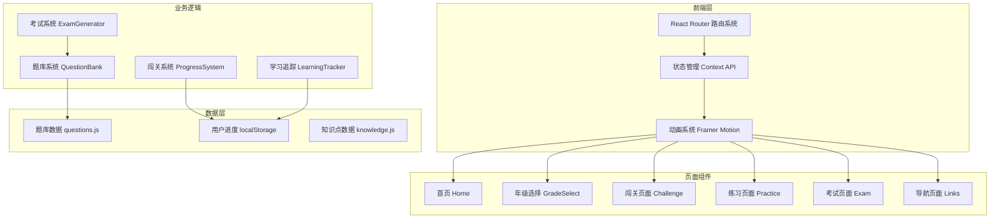

# 小学生奥数学习平台 - 技术架构文档

## 1. 架构设计



## 2. 技术选型

- **前端框架**：React@18 + Vite
- **样式方案**：Tailwind CSS@3 + 自定义CSS动画
- **动画库**：Framer Motion（页面过渡+微交互）
- **路由**：React Router DOM@6
- **图标**：Lucide React + 自定义SVG
- **数据存储**：localStorage（用户进度）
- **图表**：纯SVG实现（雷达图、进度环）

## 3. 路由定义

| 路由 | 页面 | 功能描述 |
|------|------|----------|
| `/` | 首页 | 年级入口、进度展示、导航入口 |
| `/grade/:grade` | 年级页面 | 章节列表、关卡选择 |
| `/chapter/:grade/:chapter` | 章节页面 | 闯关/练习入口 |
| `/practice/:grade/:chapter/:questionId` | 练习页面 | 题目作答、教学解析 |
| `/exam/:grade` | 考试页面 | 模拟考试、计时答题 |
| `/exam/result` | 成绩页面 | 成绩分析、错题回顾 |
| `/links` | 导航页面 | 奥数平台导航 |

## 4. 组件结构

```
src/
├── components/
│   ├── layout/
│   │   ├── Header.jsx        # 顶部导航栏
│   │   └── Footer.jsx       # 底部版权
│   ├── home/
│   │   ├── HeroSection.jsx  # 星空欢迎区
│   │   ├── GradeCards.jsx   # 年级选择卡片
│   │   └── ProgressShow.jsx  # 学习进度展示
│   ├── grade/
│   │   ├── ChapterList.jsx  # 章节列表
│   │   └── LevelGrid.jsx     # 关卡网格
│   ├── practice/
│   │   ├── QuestionCard.jsx  # 题目卡片
│   │   ├── Options.jsx       # 选项组件
│   │   ├── TeachingPanel.jsx # 教学解析区
│   │   └── Feedback.jsx     # 答题反馈
│   ├── exam/
│   │   ├── ExamTimer.jsx    # 考试计时器
│   │   ├── QuestionNav.jsx  # 题目导航
│   │   └── ResultChart.jsx  # 成绩雷达图
│   └── common/
│       ├── StarRating.jsx   # 星星评分
│       ├── ProgressRing.jsx # 环形进度
│       └── Button.jsx       # 主题按钮
├── data/
│   ├── questions/           # 按年级分类题库
│   │   ├── grade1.js
│   │   ├── grade2.js
│   │   ├── grade3.js
│   │   ├── grade4.js
│   │   ├── grade5.js
│   │   └── grade6.js
│   ├── knowledge.js         # 知识点数据
│   └── platforms.js         # 导航平台数据
├── context/
│   └── UserContext.jsx     # 用户状态管理
├── hooks/
│   ├── useProgress.js       # 进度管理
│   └── useExam.js           # 考试逻辑
├── pages/
│   ├── Home.jsx
│   ├── GradePage.jsx
│   ├── ChapterPage.jsx
│   ├── PracticePage.jsx
│   ├── ExamPage.jsx
│   ├── ExamResultPage.jsx
│   └── LinksPage.jsx
└── utils/
    ├── questionGenerator.js  # 题目生成器
    └── storage.js            # 本地存储工具
```

## 5. 题库数据结构

```javascript
// 题目对象结构
{
  id: "g1c1q1",           // 唯一标识：年级+章节+题号
  grade: 1,               // 年级 1-6
  chapter: 1,             // 章节 1-10
  difficulty: 1,         // 难度 1-4
  type: "choice",         // 题目类型：choice/blank/answer
  question: "题目文本",
  image?: "图片URL",
  options?: ["A", "B", "C", "D"],  // 选择题选项
  answer: "正确答案",
  teaching: {
    point: "知识点讲解",
    method: "解题思路",
    steps: ["步骤1", "步骤2"],      // 分步解析
    memory: "记忆口诀",
    example: "举一反三"
  },
  star: 1                 // 难度对应的星星数
}
```

## 6. 用户进度数据结构

```javascript
// localStorage 存储结构
{
  userName: "小明",
  currentGrade: 3,
  progress: {
    // 按年级组织进度
    1: {
      chapters: {
        1: { stars: 5, passed: true },  // 章节1通关获得5星
        2: { stars: 3, passed: false }
      },
      questions: {
        "g1c1q1": { passed: true, wrongCount: 0 },
        "g1c1q2": { passed: false, wrongCount: 2 }
      }
    }
  },
  examHistory: [
    { date: "2024-01-15", grade: 3, score: 85, wrongQuestions: [...] }
  ],
  totalStars: 156,
  rank: "数学小达人"
}
```

## 7. 性能优化

- 路由懒加载（React.lazy + Suspense）
- 题库数据按年级异步加载
- 图片资源懒加载
- CSS动画使用transform/opacity优化
- 本地存储定期清理和压缩
